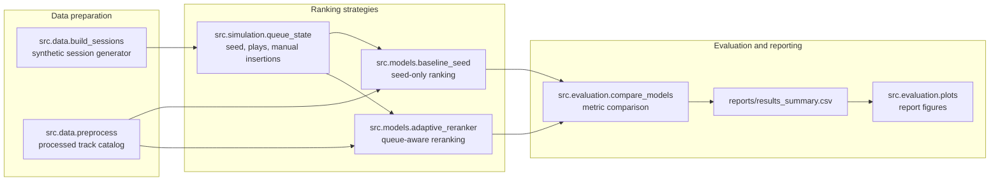
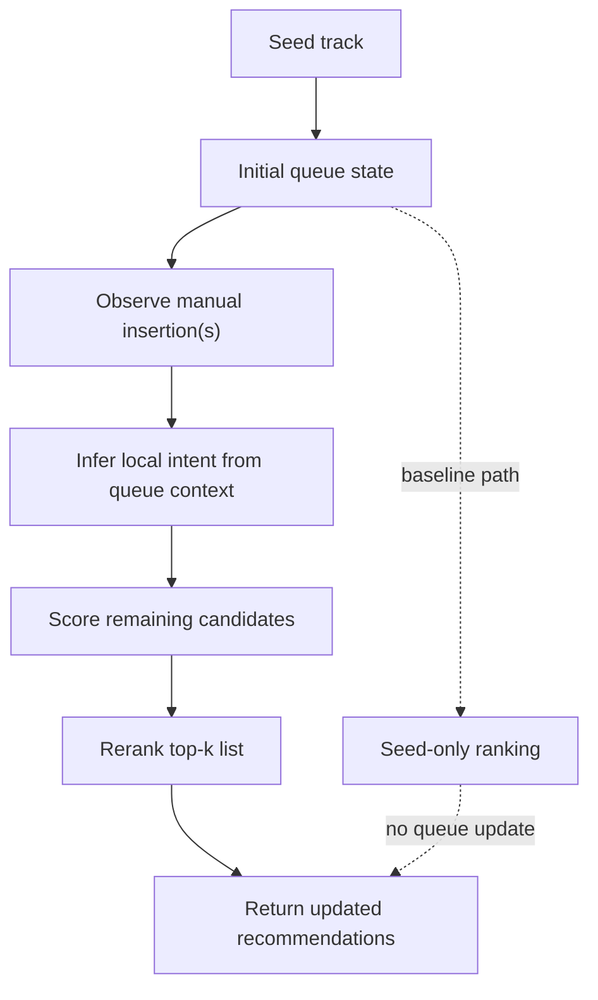

# Intent-Aware Queue Adaptation for Music Recommendation Systems

## Abstract

This note summarizes an offline prototype that tests whether manual queue insertions can act as short-term intent signals in a music recommendation workflow. The comparison is between a seed-only baseline and a queue-aware adaptive reranker operating over the same deterministic catalog and synthetic sessions. The committed results show a small but consistent intent-alignment gain in three of four scenarios, with one deliberate caution case where the adaptive reranker underperforms the baseline.

## Problem Statement

Music recommendations often start from a single seed track, but the user's intent can shift as soon as they start inserting tracks into a queue. A static ranker can miss that local shift. The question here is narrow: can a lightweight reranker respond to queue insertions without introducing unstable list reshuffles or regressing diversity?

## Method

The repository compares two ranking strategies over the same input artifacts:

- Baseline: rank candidates from the seed track only.
- Adaptive: update queue state with manual insertions, infer the local intent signal, and rerank the remaining candidates.

### System Architecture

### Queue-to-Intent-to-Reranking Flow

## Data and Simulation Setup

The evaluation is fully offline and deterministic. It uses a processed synthetic catalog and four synthetic scenario types, each represented by one committed session:

- `data/processed/processed_track_catalog.csv`
- `data/synthetic/synthetic_sessions.csv`
- `reports/results_summary.csv`

The scenario set is intentionally small and designed to probe distinct queue behaviors:

- `same_genre_continuation`
- `cross_genre_shift`
- `one_outlier_insertion`
- `repeated_consistent_insertions`

The comparison pipeline writes the scenario-level summary in `reports/results_summary.csv` and the plots in `reports/figures/`:

- `reports/figures/overall_metric_comparison.png`
- `reports/figures/scenario_intent_alignment.png`
- `reports/figures/scenario_metric_deltas.png`

## Metrics

The prototype tracks four bounded metrics:

- `intent_alignment_score`: how closely the ranked list matches inferred session intent
- `adaptation_shift_score`: how much the adaptive ranker shifts relative to the baseline
- `overreaction_penalty`: a guardrail for excessive movement in the ranked list
- `diversity_retention`: how much of the baseline diversity is preserved after reranking

## Results

The committed summary shows a modest positive effect from queue-aware reranking in three scenarios. Intent alignment improves in `same_genre_continuation` (+0.010591), `cross_genre_shift` (+0.025990), and `repeated_consistent_insertions` (+0.031026). The only negative case is `one_outlier_insertion` (-0.009308), which is the expected failure mode for a conservative reranker that should not overfit a single noisy insertion.

The non-invariant companion metric is `adaptation_shift_score`, which moves slightly by scenario and is largest in `repeated_consistent_insertions`. The truly stable guardrails are `overreaction_penalty`, which remains at `0.0` for baseline and adaptive runs, and `diversity_retention`, which stays at `1.0`, so the adaptive changes remain bounded rather than wholesale list reshuffles.

## Limitations

This is a prototype evaluation, not production validation. The sample size is tiny, each scenario is deterministic, and the sessions are synthetic rather than collected from live users. The results are therefore directional only; they do not establish statistical significance or generalize on their own to real catalog traffic.

## Future Work

- Expand beyond the current four deterministic scenarios
- Evaluate on real interaction logs once they are available
- Add statistical confidence reporting across larger session sets
- Test more expressive reranking policies while preserving the bounded-change constraint
